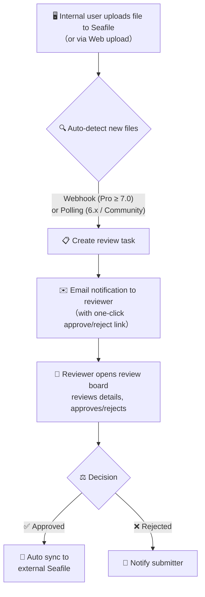
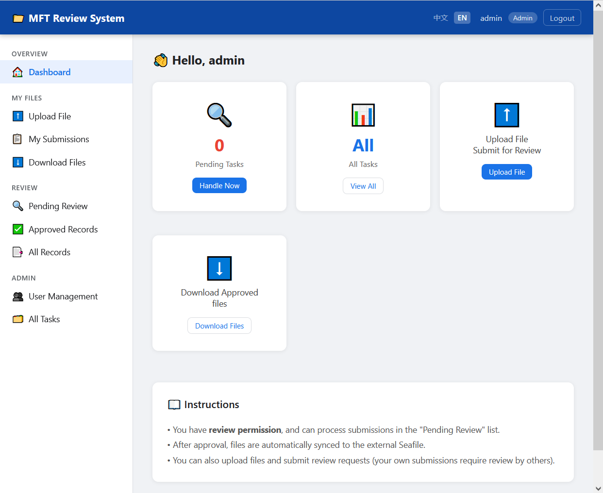
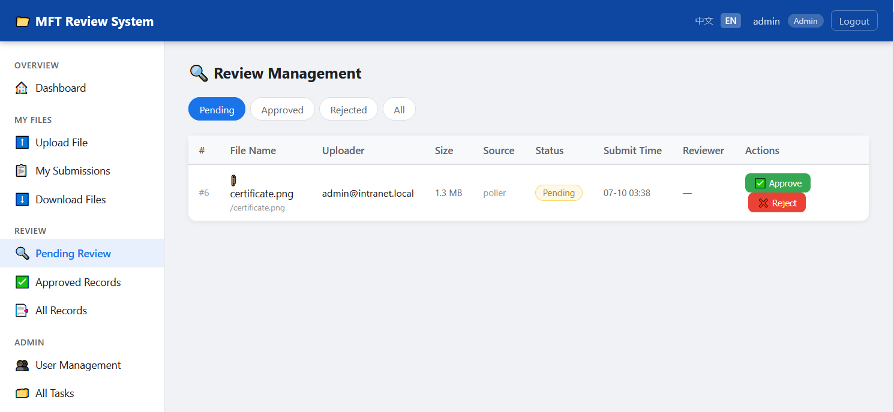
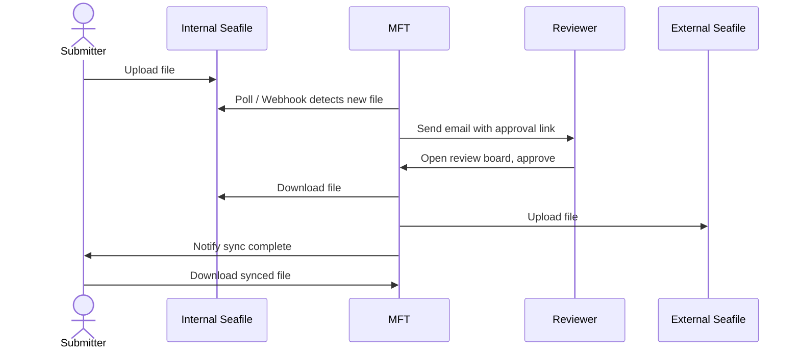

# Seafile MFT — Internal-External File Review & Sync System

English | [中文](./README_zh.md)

> **MFT** = Managed File Transfer
>
> A secure file transfer channel with an approval workflow between internal and external Seafile instances.

## Overview

The core feature of this system is: **internal users upload files to the internal Seafile, and then, through an approval process, the files are synced to the external Seafile**. For this, the user's environment needs to meet the following conditions:

- Separation between internal and external networks, with Seafile deployed on both networks
- A server with two network cards that can connect both networks, on which this MFT system is deployed

### Core Workflow



### Key Features

| Feature | Description |
|---------|-------------|
| 🔍 **Smart File Detection** | Auto-detect Seafile version and edition (Community/Pro). Pro >= 7.0 uses real-time Webhook; Community or older versions use polling (directory traversal + mtime comparison). Manual override available. |
| 🔐 **Multi-Auth Support** | Three authentication modes via `AUTH_METHOD`: `local` (local accounts only), `ldap` (LDAP + local admin fallback), `seafile` (Seafile API token auth). Admin always uses local auth. |
| 👥 **Local Accounts** | Built-in local user management: admin can create, edit, enable/disable users, assign roles, reset passwords, and delete users |
| 🔑 **Password Management** | Users can change their own password; admins can reset and delete other users' accounts |
| 👤 **Role-Based Access** | Submitter (upload + view own submissions), Reviewer (review all tasks + audit log), Admin (review + user management + all permissions) |
| 🌐 **i18n Multi-Language** | Built-in Chinese/English support with auto-detection (Cookie → Query → Accept-Language → zh fallback). Easy to add more languages via JSON translation files. |
| ✉️ **Dual SMTP** | Separate email configs for internal/external networks; approval links auto-point to the correct App URL; reviewer emails auto-merge from DB reviewer users |
| 📤 **Web Upload** | Users can upload files directly via the web UI to internal Seafile and trigger review |
| 📋 **Review Board** | Reviewers can batch view, approve, and reject pending tasks; hover tooltip for reviewer comments |
| ⬇️ **File Downloads** | After approval, users can download synced files from the external Seafile |
| 🖥️ **Admin Panel** | Admins can view all tasks, manage users, view audit logs, and manually trigger polling |
| 📜 **Audit Log** | Comprehensive operation log tracking 14 action types (create/approve/reject tasks, manage users, file transfers, etc.) with filtering and pagination |
| 🛡️ **File Deduplication** | Smart dedup prevents duplicate review tasks for the same file, even when Seafile creates new commits on access |
| 🐳 **Docker Deployment** | One-command build; all configuration via environment variables |

## Quick Start

### 1. Prepare Configuration

```bash
cp .env.example .env
# Edit .env with your Seafile URLs/Tokens, SMTP, LDAP, etc.
```

### 2. Docker Deployment (Recommended)

```bash
docker compose up -d

# View logs
docker compose logs -f seafile-mft
```

The service listens on port `8081` by default. Visit `http://<server-ip>:8081` to access the login page.

### 3. Local Development

```bash
pip install -r requirements.txt
uvicorn app.main:app --host 0.0.0.0 --port 8080 --reload
```



### 4. Local Testing

[Local Testing](./test/README.md). Local testing will create 2 docker networks as intranet and extranet, and deploy 2 seafile containers in the 2 networks, then start Seafile-MFT container, access through `http://localhost:8081`.


## Configuration Reference

### All Configuration Items

| Config Key | Description | Default |
|------------|-------------|---------|
| **Internal Seafile** | | |
| `INTRANET_SEAFILE_URL` | Internal Seafile URL | `http://seafile.internal:8000` |
| `INTRANET_SEAFILE_TOKEN` | Internal Seafile API Token | — |
| `INTRANET_REPO_ID` | Internal monitored library UUID | — |
| **External Seafile** | | |
| `EXTRANET_SEAFILE_URL` | External Seafile URL | `https://seafile.example.com` |
| `EXTRANET_SEAFILE_TOKEN` | External Seafile API Token | — |
| `EXTRANET_REPO_ID` | External target library UUID | — |
| **Internal SMTP** | Approval links point to `INTRANET_APP_URL` | |
| `INTRANET_SMTP_HOST` | Internal mail server | — |
| `INTRANET_SMTP_PORT` | Port | `465` |
| `INTRANET_SMTP_USER` | Sender email | — |
| `INTRANET_SMTP_PASSWORD` | Email password / app password | — |
| `INTRANET_SMTP_USE_SSL` | Use SSL | `true` |
| **External SMTP** | Approval links point to `EXTRANET_APP_URL`; leave blank to send internal emails only | |
| `EXTRANET_SMTP_HOST` | External mail server | — |
| `EXTRANET_SMTP_PORT` | Port | `465` |
| `EXTRANET_SMTP_USER` | Sender email | — |
| `EXTRANET_SMTP_PASSWORD` | Email password / app password | — |
| `EXTRANET_SMTP_USE_SSL` | Use SSL | `true` |
| **App URLs** | Used for approval links in emails | |
| `INTRANET_APP_URL` | Internal access URL for this service | — |
| `EXTRANET_APP_URL` | External access URL for this service | — |
| `APP_BASE_URL` | Fallback if both internal/external URLs are empty | `http://localhost:8080` |
| **Review** | | |
| `REVIEWER_EMAILS` | Reviewer email addresses (comma-separated) | — |
| `REVIEW_TOKEN_EXPIRE_HOURS` | Validity period of email approval links | `72` |
| **Authentication** | | |
| `AUTH_METHOD` | Auth mode: `local` / `ldap` / `seafile` | `local` |
| `AUTH_SEAFILE` | Which Seafile to verify against (only when `AUTH_METHOD=seafile`): `intranet` / `extranet` | `intranet` |
| **LDAP Auth** | Only used when `AUTH_METHOD=ldap` | |
| `LDAP_HOST` | LDAP server address | — |
| `LDAP_PORT` | LDAP port | `389` |
| `LDAP_USE_SSL` | Use LDAPS | `false` |
| `LDAP_BASE_DN` | Search base DN | `dc=example,dc=com` |
| `LDAP_USER_DN_TEMPLATE` | User DN template (e.g., `uid={username},ou=users,...`) | — |
| `LDAP_REVIEWER_GROUP` | LDAP group CN for reviewers | `mft-reviewers` |
| `LDAP_ADMIN_GROUP` | LDAP group CN for admins | `mft-admins` |
| **Local Accounts** | | |
| `DEFAULT_ADMIN_PASSWORD` | Password for the auto-created admin on first deploy | `admin123` |
| **File Detection** | | |
| `DETECTION_MODE` | `auto` / `webhook` / `poll` | `auto` |
| `WEBHOOK_SECRET` | Webhook HMAC signing secret | — |
| `POLL_INTERVAL_SECONDS` | Polling interval in seconds | `60` |
| `POLL_ON_STARTUP` | Run a poll immediately on startup | `true` |
| **General** | | |
| `SECRET_KEY` | Application secret key | `change-me` |
| `DATABASE_URL` | Database path | `sqlite:///./seafile_mft.db` |

### Obtaining the Seafile API Token

```bash
curl -d "username=admin@example.com&password=yourpass" \
  https://seafile.example.com/api2/auth-token/
```

### Finding the Repo ID

Log into Seafile and open a library — the UUID in the URL is the Repo ID:
```
https://seafile.example.com/library/550e8400-e29b-41d4-a716-446655440000/
                                        ↑ Repo ID
```

## File Detection Modes

The system supports two file detection methods, controlled by the `DETECTION_MODE` environment variable:

| Mode | Description | Requirements |
|------|-------------|--------------|
| `auto` | Queries Seafile `/api2/server-info/` on startup and auto-selects based on version + edition | **Recommended** |
| `webhook` | Force Webhook real-time triggering | Seafile **Pro Edition** >= 7.0 |
| `poll` | Force scheduled polling | All versions (including Community Edition) |

### ⚠️ Webhook Version Limitations (Important)

**Webhook is exclusive to Seafile Pro Edition.** Community Edition does not include this feature.

| Seafile Version | `features` Field | Webhook API | Supported Detection |
|-----------------|------------------|-------------|---------------------|
| Community (any version) | `["seafile-basic"]` | ❌ Returns 404 | Polling only |
| Pro >= 7.0 | Contains `"seafile-pro"` | ✅ Available | Webhook or polling |
| Pro < 7.0 | Contains `"seafile-pro"` | ⚠️ Limited support | Polling recommended |

**How to check if your Seafile supports Webhook:**

```bash
# Query server-info
curl -s http://<seafile-url>/api2/server-info/ | python3 -m json.tool

# Check the features field:
# Contains "seafile-pro"  → Pro Edition, Webhook supported
# Only "seafile-basic"    → Community Edition, Webhook NOT supported
```

**`auto` mode selection logic:**
- Pro Edition + version >= 7.0 → Webhook mode (real-time)
- Community Edition (any version) → Polling mode
- Pro Edition + version < 7.0 → Polling mode
- Unable to query version info → Polling mode (safe fallback)

> **If you manually set `webhook` but are on Community Edition**, MFT will print a warning on startup but will not prevent the service from running. The Webhook endpoint will exist but will never receive events — switch to `poll` or `auto`.

### Webhook Mode Setup (Pro Edition >= 7.0)

**Prerequisite: Seafile must be Pro Edition.**

In the Seafile admin panel → System Admin → Webhook, add a callback URL:
```
http://<MFT-server-ip>:8081/webhook/seafile
```
Set the same signing secret as `WEBHOOK_SECRET` to enable HMAC-SHA256 signature verification.

> You can also register a Webhook via API:
> ```bash
> curl -X POST "http://<seafile-url>/api/v2.1/repos/<repo_id>/webhooks/" \
>   -H "Authorization: Token <token>" \
>   -H "Content-Type: application/json" \
>   -d '{"url":"http://<mft-ip>:8081/webhook/seafile","secret":"<WEBHOOK_SECRET>"}'
> ```

**Example Webhook payload (sent by Seafile Pro):**
```json
{
    "event": "repo-update",
    "repo_id": "xxx",
    "operator": "user@example.com",
    "commit_id": "xxx",
    "changed_files": {
        "added": ["/path/to/new_file.pdf"],
        "modified": ["/path/to/updated.txt"],
        "deleted": []
    }
}
```

### Polling Mode (Compatible with All Versions)

The system traverses the internal library directory every `POLL_INTERVAL_SECONDS` seconds, detecting new/modified files by comparing file `mtime` timestamps.

**How polling works:**
1. Fetches the latest commit list (`GET /api2/repos/{id}/history/`) and finds commits newer than the last processed `commit_id`
2. Recursively traverses all files in the repository (`GET /api2/repos/{id}/dir/`) to find files with `mtime` after the new commit time
3. Creates review tasks for each new/modified file
4. Persists progress via the `PollerState` table — no duplicate processing after restart

> **Why directory traversal instead of commit diffs?** Seafile 6.x returns 404 for both `GET /api2/repos/{id}/commits/{commit_id}/` and `GET /api2/repos/{id}/history/{commit_id}/`, making it impossible to get per-commit file changes. Directory traversal + mtime comparison is the most reliable approach compatible with all versions.

## Authentication Modes

The system supports three authentication methods, controlled by the `AUTH_METHOD` environment variable:

| Mode | Description | Admin Login | User Login |
|------|-------------|-------------|------------|
| `local` | Local accounts only | Local DB | Local DB |
| `ldap` | LDAP primary with local fallback | Local DB | LDAP (falls back to local on failure) |
| `seafile` | Seafile API token authentication | Local DB | Seafile `POST /api2/auth-token/` |

> **Admin always authenticates locally** regardless of `AUTH_METHOD`. This ensures admin access is never blocked by LDAP or Seafile server outages.

### `local` Mode

All users authenticate against the local database. The admin creates user accounts and sets initial passwords. Users can change their own password via the Change Password page.

### `ldap` Mode

- Non-admin users authenticate via LDAP (AD). On success, user info (email, display name, role) is synced to the local DB.
- If LDAP authentication fails, the system falls back to local password verification (useful for pre-created local accounts).
- LDAP group membership determines the user's role:
  - Member of `LDAP_ADMIN_GROUP` → admin
  - Member of `LDAP_REVIEWER_GROUP` → reviewer
  - Others → submitter
- Roles are refreshed on every login.

### `seafile` Mode

- Non-admin users authenticate via the Seafile API: `POST /api2/auth-token/` with username and password. If a token is returned, authentication succeeds.
- Use `AUTH_SEAFILE` to select which Seafile instance to verify against:
  - `intranet` — uses `INTRANET_SEAFILE_URL`
  - `extranet` — uses `EXTRANET_SEAFILE_URL`
- On first login, the user is created in the local DB with the submitter role. Admins can adjust roles in the user management page.
- On subsequent logins, the system attempts to fetch the user's profile (`GET /api/v2.1/user/`) to update email and display name.
- Password changes are not available for Seafile-authenticated users — passwords must be changed on the Seafile server.

## User Roles & Permissions

| Role | Permissions |
|------|-------------|
| **Submitter** | Upload files to internal Seafile, view own submissions, download synced external files |
| **Reviewer** | Review all pending tasks (approve/reject), download synced external files |
| **Admin** | Submitter + Reviewer + User management (create/edit/disable/change roles) + View all tasks |

LDAP user roles are mapped via AD groups: members of `LDAP_ADMIN_GROUP` become admins, members of `LDAP_REVIEWER_GROUP` become reviewers, others become submitters. Roles are refreshed on every login. Seafile-auth users default to submitter role on first login; admins can adjust roles in the user management page.

## Web Interface

| Page | Path | Access |
|------|------|--------|
| Login | `/login` | Public |
| Dashboard | `/dashboard` | Authenticated users |
| Upload File | `/my/upload` | All users |
| My Submissions | `/my/submissions` | All users |
| Review Board | `/review-board` | Reviewer / Admin |
| Download Files | `/downloads` | All users (own files only, or all for reviewers) |
| Change Password | `/change-password` | All users |
| User Management | `/admin/users` | Admin |
| Audit Log | `/admin/audit-log` | Reviewer / Admin |



## API Endpoints

| Endpoint | Method | Description |
|----------|--------|-------------|
| `/` | GET | Redirects to `/dashboard` |
| `/health` | GET | Health check (includes current detection mode) |
| `/login` | GET/POST | Login page / submit login |
| `/logout` | GET | Logout |
| `/change-password` | GET/POST | Change own password |
| `/review/{token}` | GET/POST | Email approval link (detail page / submit decision) |
| `/admin/poll-now` | POST | Manually trigger immediate polling |
| `/admin/detection-mode` | GET | Query current file detection mode |
| `/admin/users` | GET | User management page |
| `/admin/users/create` | POST | Create local user |
| `/admin/users/{id}/edit` | POST | Edit user attributes |
| `/admin/users/{id}/role` | POST | Change user role |
| `/admin/users/{id}/toggle` | POST | Enable/disable user |
| `/admin/users/{id}/reset-password` | POST | Reset user password (admin only) |
| `/admin/users/{id}/delete` | POST | Delete local user (admin only) |
| `/admin/audit-log` | GET | Audit log (reviewer/admin) |
| `/webhook/seafile` | POST | Seafile Webhook callback (Webhook mode only) |
| `/docs` | GET | Swagger API documentation |

## Directory Structure

```
seafile-MFT/
├── app/
│   ├── main.py              # FastAPI entry point, lifecycle management, auto detection mode
│   ├── config.py            # Global configuration (dual SMTP, LDAP, detection mode, etc.)
│   ├── models.py            # Database models (User / UserSession / ReviewTask / PollerState / AuditLog)
│   ├── auth.py              # Multi-auth (local/LDAP/Seafile), session management, permission dependencies, local user CRUD
│   ├── audit.py             # Audit logging module (14 action types, integrated across all modules)
│   ├── portal.py            # Web route handlers (login/upload/review board/downloads/user management/audit log)
│   ├── review.py            # Email token-based approval link handling
│   ├── poller.py            # Polling core (directory traversal + mtime comparison, compatible with Seafile 6.x)
│   ├── webhook.py           # Webhook callback handling (HMAC-SHA256 signature verification)
│   ├── seafile_version.py   # Seafile version detection module
│   ├── transfer.py          # Seafile file transfer (internal download → external upload)
│   ├── email_notify.py      # Dual SMTP email notifications
│   ├── i18n/
│   │   ├── __init__.py      # Translation manager (JSON-based, Chinese as key, fallback to original text)
│   │   ├── middleware.py     # FastAPI middleware (Cookie → Query → Accept-Language detection)
│   │   └── translations/
│   │       ├── zh.json      # Chinese (placeholder, key=text by design)
│   │       └── en.json      # English translations (~250 entries)
│   └── templates/
│       ├── base.html        # Unified layout (Header + sidebar + responsive, i18n-aware)
│       ├── login.html       # Login page
│       ├── dashboard.html   # Dashboard (role-based stats)
│       ├── upload.html      # Web file upload page
│       ├── my_submissions.html  # My submissions list
│       ├── review_board.html    # Review board (with comment tooltip)
│       ├── review.html      # Email approval detail page
│       ├── downloads.html   # Synced file download list
│       ├── change_password.html # Change own password
│       ├── admin.html       # Admin panel (all tasks)
│       ├── admin_users.html # User management (create/edit/enable-disable/role change/reset password/delete)
│       ├── audit_log.html   # Audit log with filtering and pagination
│       └── email/
│           ├── review_notify.html  # Review notification email template
│           └── result_notify.html  # Approval result email template
├── requirements.txt
├── Dockerfile
├── docker-compose.yml
└── README.md
```

## Workflow Preview

**Review flow overview:**



## Extension Ideas

- ✅ **Audit log** — Implemented! Records all operations (task creation, approval, user management, file transfers, etc.) with filtering and pagination.
- ✅ **Seafile auth** — Implemented! Users can now authenticate directly via Seafile API (`AUTH_METHOD=seafile`), in addition to local and LDAP modes.
- **Multi-library mapping**: Modify poller/webhook modules to support multiple internal libraries mapped to different external libraries
- **Approval rules**: Auto-approve or require manual review based on file type, size, etc.
- **Multi-reviewer**: Implement countersign (all must approve) or or-sign (anyone can approve)
- **File preview**: Add PDF/image online preview on the review page
- **External auth providers**: Add OAuth2/OIDC support (e.g., Google, GitHub, Microsoft Entra ID)
- **REST API + webhook for external integrations**: Expose a documented REST API and webhook notifications so third-party systems (CI/CD, CMS, ERP) can submit files or react to review events
- **Dashboard analytics**: Add charts and statistics for review throughput, approval rates, and file transfer volumes
- **More languages**: Add translation JSON files for additional locales (ja, ko, fr, de, etc.) — the i18n framework makes this straightforward

## License

GPLv3
