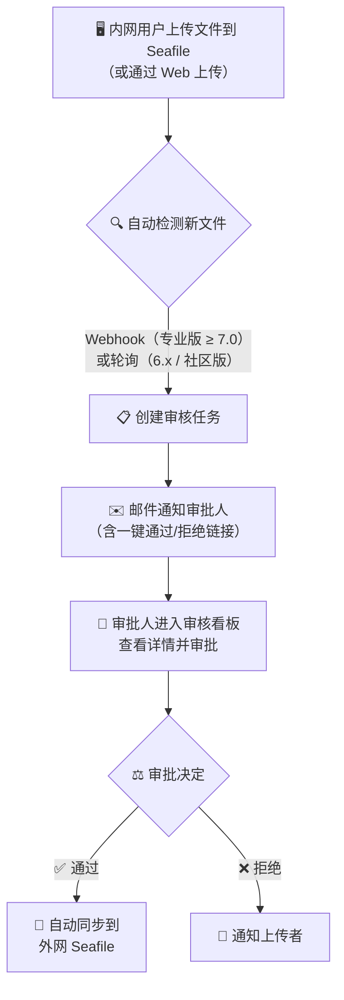
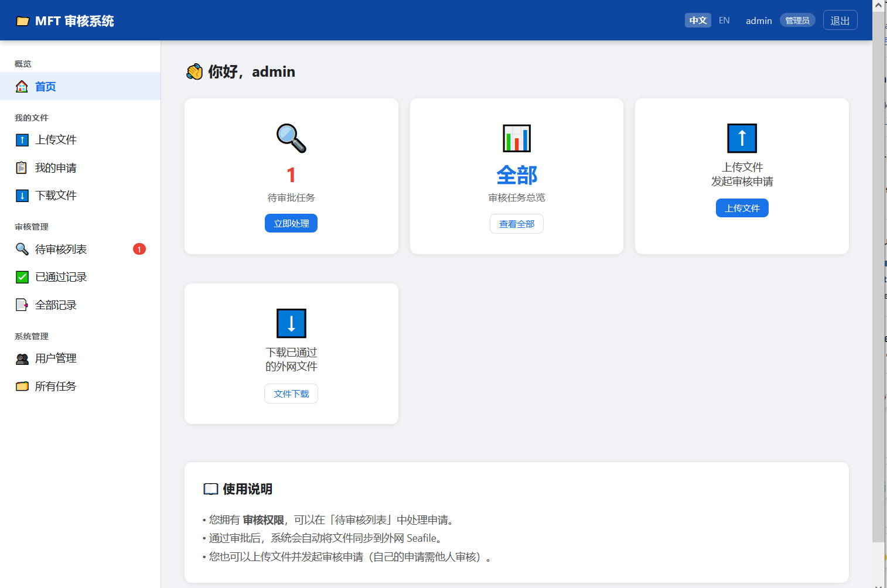
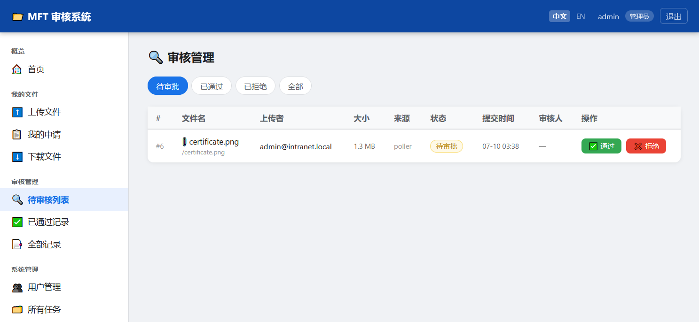
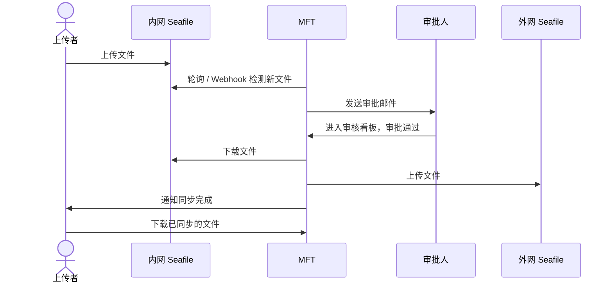

# Seafile MFT — 内外网文件审核同步系统

> **MFT** = Managed File Transfer（受控文件传输）
>
> 在内网 Seafile 与外网 Seafile 之间建立带审批流程的安全文件传输通道。

## 功能概述

本系统的核心功能是：**内网用户上传文件到内网 Seafile，然后通过审批流程同步到外网 Seafile**。这需要用户所在的环境具备以下条件：

- 内外网区隔，两个网络里都部署了 Seafile
- 内外网之间存在拥有两个网卡的服务器能够连通两个网络，本 MFT 系统即部署在此服务器上

### 核心流程



### 主要特性

| 特性 | 说明 |
|------|------|
| 🔍 **智能文件检测** | 自动识别 Seafile 版本和版本类型（社区版/专业版），专业版 >= 7.0 走 Webhook 实时检测，社区版或旧版走轮询（目录遍历 + mtime 对比），可手动指定模式 |
| 🔐 **多认证模式** | 通过 `AUTH_METHOD` 支持三种认证方式：`local`（仅本地账号）、`ldap`（LDAP + 本地 admin 回退）、`seafile`（Seafile API Token 认证）。管理员始终使用本地认证。 |
| 👥 **本地账号** | 内置本地用户管理，管理员可创建、编辑、禁用/启用用户，分配角色，重置密码，删除用户 |
| 🔑 **密码管理** | 用户可修改自己的密码；管理员可重置其他用户密码及删除非 LDAP 用户 |
| 👤 **角色权限** | 提交者（上传 + 查看自己的申请）、审核者（审核所有申请 + 审计日志）、管理员（审核 + 用户管理 + 全部权限） |
| 🌐 **多语言支持** | 内置中英文双语，自动检测语言（Cookie → Query → Accept-Language → 默认中文），通过 JSON 翻译文件轻松扩展更多语言 |
| ✉️ **双 SMTP** | 内网/外网各一套邮件配置，审批链接自动指向对应网络的 App URL；审核者邮箱自动合并数据库中的审核角色用户 |
| 📤 **Web 上传** | 用户可直接通过 Web 界面上传文件到内网 Seafile 并发起审核 |
| 📋 **审核看板** | 审核者 Web 界面批量查看、通过、拒绝待审任务；鼠标悬停可查看审批备注 |
| ⬇️ **文件下载** | 审核通过后，用户可从外网 Seafile 下载已同步的文件 |
| 🖥️ **管理后台** | 管理员可查看所有任务、管理用户、查看审计日志、手动触发轮询 |
| 📜 **审计日志** | 完整的操作记录追踪，覆盖 14 种操作类型（创建/审批任务、管理用户、文件传输等），支持筛选和分页 |
| 🛡️ **文件去重** | 智能去重，防止 Seafile 浏览产生新 commit 时对同一文件重复创建审核任务 |
| 🐳 **Docker 部署** | 一键构建，所有配置通过环境变量传递 |

## 快速开始

### 1. 准备配置文件

```bash
cp .env.example .env
# 编辑 .env，填入 Seafile 地址/Token、SMTP、LDAP 等配置
```

### 2. Docker 部署（推荐）

```bash
docker compose up -d

# 查看日志
docker compose logs -f seafile-mft
```

服务默认监听 `8081` 端口，访问 `http://<服务器IP>:8081` 进入登录页。

### 3. 本地开发运行

```bash
pip install -r requirements.txt
uvicorn app.main:app --host 0.0.0.0 --port 8080 --reload
```



### 4. 本地测试

[本地测试说明](./test/README_zh.md)。本地测试会创建两个 docker 网络，分别作为内网和外网，然后在两个网络中分别部署内外网 Seafile 容器，最后启动 Seafile-MFT 容器，通过 `http://localhost:8081` 访问。


## 配置说明

### 完整配置项

| 配置项 | 说明 | 默认值 |
|--------|------|--------|
| **内网 Seafile** | | |
| `INTRANET_SEAFILE_URL` | 内网 Seafile 地址 | `http://seafile.internal:8000` |
| `INTRANET_SEAFILE_TOKEN` | 内网 Seafile API Token | — |
| `INTRANET_REPO_ID` | 内网监听的文件库 UUID | — |
| **外网 Seafile** | | |
| `EXTRANET_SEAFILE_URL` | 外网 Seafile 地址 | `https://seafile.example.com` |
| `EXTRANET_SEAFILE_TOKEN` | 外网 Seafile API Token | — |
| `EXTRANET_REPO_ID` | 外网目标文件库 UUID | — |
| **内网 SMTP** | 审批链接指向 `INTRANET_APP_URL` | |
| `INTRANET_SMTP_HOST` | 内网邮件服务器 | — |
| `INTRANET_SMTP_PORT` | 端口 | `465` |
| `INTRANET_SMTP_USER` | 发件邮箱 | — |
| `INTRANET_SMTP_PASSWORD` | 邮件密码/授权码 | — |
| `INTRANET_SMTP_USE_SSL` | 是否 SSL | `true` |
| **外网 SMTP** | 审批链接指向 `EXTRANET_APP_URL`；留空则只发内网邮件 | |
| `EXTRANET_SMTP_HOST` | 外网邮件服务器 | — |
| `EXTRANET_SMTP_PORT` | 端口 | `465` |
| `EXTRANET_SMTP_USER` | 发件邮箱 | — |
| `EXTRANET_SMTP_PASSWORD` | 邮件密码/授权码 | — |
| `EXTRANET_SMTP_USE_SSL` | 是否 SSL | `true` |
| **应用地址** | 用于邮件中的审批链接 | |
| `INTRANET_APP_URL` | 内网访问本服务的地址 | — |
| `EXTRANET_APP_URL` | 外网访问本服务的地址 | — |
| `APP_BASE_URL` | 兼容旧字段，内/外网地址均为空时回退 | `http://localhost:8080` |
| **审批** | | |
| `REVIEWER_EMAILS` | 审批人邮箱（逗号分隔） | — |
| `REVIEW_TOKEN_EXPIRE_HOURS` | 邮件中审批链接有效时间 | `72` |
| **认证** | | |
| `AUTH_METHOD` | 认证方式：`local` / `ldap` / `seafile` | `local` |
| `AUTH_SEAFILE` | Seafile 认证时使用哪个 Seafile（仅 `AUTH_METHOD=seafile`）：`intranet` / `extranet` | `intranet` |
| **LDAP 认证** | 仅 `AUTH_METHOD=ldap` 时生效 | |
| `LDAP_HOST` | LDAP 服务器地址 | — |
| `LDAP_PORT` | LDAP 端口 | `389` |
| `LDAP_USE_SSL` | 是否 LDAPS | `false` |
| `LDAP_BASE_DN` | 搜索基础 DN | `dc=example,dc=com` |
| `LDAP_USER_DN_TEMPLATE` | 用户 DN 模板（如 `uid={username},ou=users,...`） | — |
| `LDAP_REVIEWER_GROUP` | 对应审核者的 LDAP 组名（CN） | `mft-reviewers` |
| `LDAP_ADMIN_GROUP` | 对应管理员的 LDAP 组名（CN） | `mft-admins` |
| **本地账号** | | |
| `DEFAULT_ADMIN_PASSWORD` | 首次部署自动创建 admin 的密码 | `admin123` |
| **文件检测** | | |
| `DETECTION_MODE` | `auto` / `webhook` / `poll` | `auto` |
| `WEBHOOK_SECRET` | Webhook HMAC 签名密钥 | — |
| `POLL_INTERVAL_SECONDS` | 轮询间隔（秒） | `60` |
| `POLL_ON_STARTUP` | 启动时立即执行一次轮询 | `true` |
| **基础** | | |
| `SECRET_KEY` | 应用密钥 | `change-me` |
| `DATABASE_URL` | 数据库路径 | `sqlite:///./seafile_mft.db` |

### 获取 Seafile API Token

```bash
curl -d "username=admin@example.com&password=yourpass" \
  https://seafile.example.com/api2/auth-token/
```

### 获取 Repo ID

登录 Seafile 进入文件库，URL 中的 UUID 即为 Repo ID：
```
https://seafile.example.com/library/550e8400-e29b-41d4-a716-446655440000/
                                        ↑ Repo ID
```

## 文件检测模式

系统支持两种文件检测方式，通过 `DETECTION_MODE` 环境变量控制：

| 模式 | 说明 | 适用条件 |
|------|------|----------|
| `auto` | 启动时自动查询 Seafile `/api2/server-info/`，根据版本+版本类型自动选择 | **推荐** |
| `webhook` | 强制使用 Webhook 实时触发 | Seafile **专业版** >= 7.0 |
| `poll` | 强制使用定时轮询 | 所有版本（含社区版） |

### ⚠️ Webhook 版本限制（重要）

**Webhook 是 Seafile 专业版（Pro Edition）的独占功能**，社区版（Community Edition）不包含此功能。

| Seafile 版本 | `features` 字段 | Webhook API | 支持的检测模式 |
|-------------|-----------------|-------------|---------------|
| 社区版（任意版本） | `["seafile-basic"]` | ❌ 返回 404 | 仅轮询 |
| 专业版 >= 7.0 | 包含 `"seafile-pro"` | ✅ 可用 | Webhook 或轮询 |
| 专业版 < 7.0 | 包含 `"seafile-pro"` | ⚠️ 支持有限 | 建议轮询 |

**如何判断当前 Seafile 是否支持 Webhook：**

```bash
# 查询 server-info
curl -s http://<seafile-url>/api2/server-info/ | python3 -m json.tool

# 检查 features 字段
# 包含 "seafile-pro"  → 专业版，支持 Webhook
# 仅含 "seafile-basic" → 社区版，不支持 Webhook
```

**`auto` 模式自动选择逻辑：**
- 专业版 + 版本 >= 7.0 → Webhook 模式（实时）
- 社区版（任意版本） → 轮询模式
- 专业版 + 版本 < 7.0 → 轮询模式
- 无法查询版本信息 → 轮询模式（安全降级）

> **如果手动指定 `webhook` 但实际为社区版**，MFT 启动时会打印警告日志，但不会阻止启动。此时 Webhook 端点虽存在但永远不会收到事件，需改用 `poll` 或 `auto`。

### Webhook 模式配置（专业版 >= 7.0）

**前提条件：Seafile 必须是专业版（Pro Edition）。**

在 Seafile 后台 → 系统管理 → Webhook 中添加回调地址：
```
http://<MFT服务器IP>:8081/webhook/seafile
```
并设置与 `WEBHOOK_SECRET` 相同的签名密钥，实现 HMAC-SHA256 签名验证。

> 也可以通过 API 注册 Webhook：
> ```bash
> curl -X POST "http://<seafile-url>/api/v2.1/repos/<repo_id>/webhooks/" \
>   -H "Authorization: Token <token>" \
>   -H "Content-Type: application/json" \
>   -d '{"url":"http://<mft-ip>:8081/webhook/seafile","secret":"<WEBHOOK_SECRET>"}'
> ```

**Webhook payload 示例（Seafile 专业版发送）：**
```json
{
    "event": "repo-update",
    "repo_id": "xxx",
    "operator": "user@example.com",
    "commit_id": "xxx",
    "changed_files": {
        "added": ["/path/to/new_file.pdf"],
        "modified": ["/path/to/updated.txt"],
        "deleted": []
    }
}
```

### 轮询模式（所有版本兼容）

系统每 `POLL_INTERVAL_SECONDS` 秒遍历内网文件库目录，通过比较文件 `mtime` 时间戳来检测新增/修改的文件。

**轮询工作原理：**
1. 拉取最新 commit 列表（`GET /api2/repos/{id}/history/`），找到比上次处理的 `commit_id` 更新的提交
2. 遍历仓库所有文件（递归 `GET /api2/repos/{id}/dir/`），找出 `mtime` 在新 commit 时间之后的文件
3. 为每个新增/修改文件创建审核任务
4. 通过 `PollerState` 表持久化处理进度，重启后不会重复处理

> **为什么选择目录遍历而非 commit diff？** Seafile 6.x 的 `GET /api2/repos/{id}/commits/{commit_id}/` 和 `GET /api2/repos/{id}/history/{commit_id}/` 均返回 404，无法获取单个 commit 的文件变更。目录遍历 + mtime 对比是兼容所有版本的最可靠方案。

## 认证模式

系统支持三种认证方式，通过 `AUTH_METHOD` 环境变量控制：

| 模式 | 说明 | 管理员登录 | 用户登录 |
|------|------|-----------|----------|
| `local` | 仅本地账号 | 本地数据库 | 本地数据库 |
| `ldap` | LDAP 优先，失败回退本地 | 本地数据库 | LDAP（失败后回退本地验证） |
| `seafile` | Seafile API Token 认证 | 本地数据库 | Seafile `POST /api2/auth-token/` |

> **管理员始终使用本地认证**，不受 `AUTH_METHOD` 影响。这确保了 LDAP 或 Seafile 服务器故障时管理员仍可登录。

### `local` 模式

所有用户通过本地数据库认证。管理员创建用户账号并设置初始密码，用户可在修改密码页面更改自己的密码。

### `ldap` 模式

- 非管理员用户通过 LDAP（AD）认证。成功后，用户信息（邮箱、显示名、角色）同步到本地数据库。
- LDAP 认证失败时，回退到本地密码验证（适用于预创建的本地账号）。
- LDAP 组成员关系决定用户角色：
  - 属于 `LDAP_ADMIN_GROUP` → 管理员
  - 属于 `LDAP_REVIEWER_GROUP` → 审核者
  - 其他 → 提交者
- 每次登录都会刷新角色。

### `seafile` 模式

- 非管理员用户通过 Seafile API 认证：`POST /api2/auth-token/` 传入用户名和密码，拿到 token 即认证通过。
- 通过 `AUTH_SEAFILE` 选择使用哪个 Seafile 实例进行验证：
  - `intranet` — 使用 `INTRANET_SEAFILE_URL`
  - `extranet` — 使用 `EXTRANET_SEAFILE_URL`
- 首次登录时，用户以提交者角色创建到本地数据库。管理员可在用户管理页面调整角色。
- 后续登录时，系统会尝试获取用户资料（`GET /api/v2.1/user/`）以更新邮箱和显示名。
- Seafile 认证用户无法在此系统修改密码，需在 Seafile 服务器上修改。

## 用户角色与权限

| 角色 | 权限 |
|------|------|
| **提交者** (submitter) | 上传文件到内网 Seafile、查看自己的审核申请、下载已同步的外网文件 |
| **审核者** (reviewer) | 审核所有待审任务（通过/拒绝）、下载已同步的外网文件 |
| **管理员** (admin) | 提交者 + 审核者 + 用户管理（创建/编辑/禁用/更改角色）+ 查看所有任务 |

LDAP 用户的角色通过 AD 组映射：属于 `LDAP_ADMIN_GROUP` 则为管理员，属于 `LDAP_REVIEWER_GROUP` 则为审核者，否则为提交者。每次登录都会刷新角色。Seafile 认证用户首次登录时默认为提交者角色，管理员可在用户管理页面调整。

## Web 界面

| 页面 | 路径 | 权限 |
|------|------|------|
| 登录 | `/login` | 公开 |
| 首页 | `/dashboard` | 登录用户 |
| 上传文件 | `/my/upload` | 所有用户 |
| 我的申请 | `/my/submissions` | 所有用户 |
| 审核看板 | `/review-board` | 审核者/管理员 |
| 下载文件 | `/downloads` | 所有用户（仅自己的文件或审核者看全部） |
| 修改密码 | `/change-password` | 所有用户 |
| 用户管理 | `/admin/users` | 管理员 |
| 审计日志 | `/admin/audit-log` | 审核者/管理员 |



## API 端点

| 端点 | 方法 | 说明 |
|------|------|------|
| `/` | GET | 重定向到 `/dashboard` |
| `/health` | GET | 健康检查（含当前检测模式） |
| `/login` | GET/POST | 登录页 / 提交登录 |
| `/logout` | GET | 注销 |
| `/change-password` | GET/POST | 修改自己的密码 |
| `/review/{token}` | GET/POST | 邮件审批链接（详情页 / 提交审批） |
| `/admin/poll-now` | POST | 手动触发立即轮询 |
| `/admin/detection-mode` | GET | 查询当前文件检测模式 |
| `/admin/users` | GET | 用户管理页面 |
| `/admin/users/create` | POST | 创建本地用户 |
| `/admin/users/{id}/edit` | POST | 编辑用户属性 |
| `/admin/users/{id}/role` | POST | 修改用户角色 |
| `/admin/users/{id}/toggle` | POST | 启用/禁用用户 |
| `/admin/users/{id}/reset-password` | POST | 重置用户密码（管理员） |
| `/admin/users/{id}/delete` | POST | 删除本地用户（管理员） |
| `/admin/audit-log` | GET | 审计日志（审核者/管理员） |
| `/webhook/seafile` | POST | Seafile Webhook 回调（仅 Webhook 模式） |
| `/docs` | GET | Swagger API 文档 |

## 目录结构

```
seafile-MFT/
├── app/
│   ├── main.py              # FastAPI 入口，生命周期管理，自动检测模式
│   ├── config.py            # 全局配置（双 SMTP、LDAP、检测模式等）
│   ├── models.py            # 数据库模型（User / UserSession / ReviewTask / PollerState / AuditLog）
│   ├── auth.py              # 多认证（本地/LDAP/Seafile）、Session 管理、权限依赖、本地用户 CRUD
│   ├── audit.py             # 审计日志模块（14 种操作类型，集成于各模块）
│   ├── portal.py            # Web 功能路由（登录/上传/审核看板/下载/用户管理/审计日志）
│   ├── review.py            # 邮件 token 审批链接处理
│   ├── poller.py            # 轮询核心（目录遍历 + mtime 对比，适配 Seafile 6.x）
│   ├── webhook.py           # Webhook 回调处理（HMAC-SHA256 签名验证）
│   ├── seafile_version.py   # Seafile 版本检测模块
│   ├── transfer.py          # Seafile 文件传输（内网下载 → 外网上传）
│   ├── email_notify.py      # 双 SMTP 邮件通知
│   ├── i18n/
│   │   ├── __init__.py      # 翻译管理器（JSON 格式，中文为 key，缺省回退原文）
│   │   ├── middleware.py     # FastAPI 中间件（Cookie → Query → Accept-Language 检测）
│   │   └── translations/
│   │       ├── zh.json      # 中文（占位文件，设计上 key 即文本）
│   │       └── en.json      # 英文翻译（约 250 条）
│   └── templates/
│       ├── base.html        # 统一布局（Header + 侧边栏 + 响应式，支持多语言）
│       ├── login.html       # 登录页
│       ├── dashboard.html   # 首页（按角色展示统计）
│       ├── upload.html      # Web 文件上传页
│       ├── my_submissions.html  # 我的申请列表
│       ├── review_board.html    # 审核看板（含备注提示框）
│       ├── review.html      # 邮件审批详情页
│       ├── downloads.html   # 已同步文件下载列表
│       ├── change_password.html # 修改密码
│       ├── admin.html       # 管理后台（所有任务）
│       ├── admin_users.html # 用户管理（创建/编辑/启用禁用/角色变更/重置密码/删除）
│       ├── audit_log.html   # 审计日志（筛选、分页）
│       └── email/
│           ├── review_notify.html  # 审核通知邮件模板
│           └── result_notify.html  # 审批结果邮件模板
├── requirements.txt
├── Dockerfile
├── docker-compose.yml
└── README.md
```

## 运行截图预览

**审核流程示意：**



## 扩展建议

- ✅ **审计日志** — 已实现！记录所有操作（任务创建、审批、用户管理、文件传输等），支持筛选和分页。
- ✅ **Seafile 认证** — 已实现！用户现在可以通过 Seafile API 直接认证（`AUTH_METHOD=seafile`），除本地和 LDAP 模式外的新选择。
- **多库映射**：修改 poller/webhook 模块支持多个内网库对应不同外网库
- **审批规则**：基于文件类型、大小自动通过或需要人工审批
- **多审批人**：实现会签（所有人通过）或或签（一人通过即可）
- **文件预览**：在审批页添加 PDF / 图片在线预览
- **外部认证**：添加 OAuth2/OIDC 支持（如 Google、GitHub、Microsoft Entra ID）
- **REST API + Webhook 外部集成**：提供标准 REST API 和 Webhook 通知，允许第三方系统（CI/CD、CMS、ERP）提交文件或响应审核事件
- **仪表板分析**：添加审核吞吐量、通过率、文件传输量等图表统计
- **更多语言**：为其他地区添加翻译 JSON 文件（日语、韩语、法语、德语等）——多语言框架使扩展非常简单

## 许可

GPLv3
