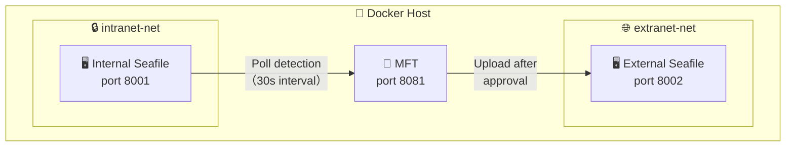

# Seafile MFT Test Environment

English | [中文](./README_zh.md)

Simulates the complete internal → review → external file sync workflow using Docker networks.

## Architecture



MFT connects to both networks:
- Internal: Poll for file changes → create review tasks → send emails
- External: On approval → download internal file → upload to external

## Version Detection & File Detection Modes

### Webhook Version Limitations

**Webhook is exclusive to Seafile Pro Edition.**

| Seafile Version | `features` Field | Webhook API | Supported Detection |
|-----------------|------------------|-------------|---------------------|
| Community (any version) | `["seafile-basic"]` | ❌ Returns 404 | Polling only |
| Pro >= 7.0 | Contains `"seafile-pro"` | ✅ Available | Webhook or polling |
| Pro < 7.0 | Contains `"seafile-pro"` | ⚠️ Limited support | Polling recommended |

> **Community Edition has no Webhook management UI and no Webhook API.** If you can't find the Webhook configuration in the Seafile admin panel, that's normal — it means you're using Community Edition.

**How to check your Seafile edition:**

```bash
# Query via API
curl -s http://localhost:8001/api2/server-info/ | python3 -m json.tool

# Check the features field:
# ["seafile-basic"]         → Community Edition
# Contains "seafile-pro"     → Pro Edition
```

### Detection Mode Selection

| `DETECTION_MODE` | Seafile Version | Behavior |
|-----------------|-----------------|----------|
| `auto` | Pro >= 7.0 | Auto-switch to **Webhook** mode (real-time) |
| `auto` | Pro < 7.0 or Community (any) | Auto-switch to **Polling** mode |
| `webhook` | Any | Force Webhook (Pro only; Community will warn but won't block startup) |
| `poll` | Any | Force polling (compatible with all versions) |

> **`auto` mode selection logic:**
> - On startup, queries `/api2/server-info/` for version number + `features` array
> - Both "Pro Edition" + "major version >= 7" → Webhook
> - All other cases → Polling (safe fallback)

### This Test Environment's Configuration

This test environment uses Seafile **12.0 Community Edition** (`seafileltd/seafile-mc:12.0-latest` image).

- **Detection mode**: `poll` (30-second interval)
- **Webhook not supported**: Community Edition `features=["seafile-basic"]`, Webhook API returns 404
- **To test Webhook**: Replace the Seafile image with a Pro Edition image (requires Seafile Pro license)

## Quick Start

### Prerequisites

- Docker Engine 20.10+
- Docker Compose v2
- At least 4 GB available memory
- Ports 8001, 8002, 8081 must be free

### 1. Start All Services

```bash
cd test
docker compose up -d
```

The first startup takes **2–3 minutes** for Seafile initialization (creating databases, admin accounts, etc.).
Check the logs to confirm readiness:

```bash
docker compose logs -f seafile-intranet seafile-extranet
```

Wait for the `healthy` status to appear.

### 2. Run the Setup Script

```bash
chmod +x setup.sh
./setup.sh
```

The script automatically:
1. Waits for both Seafile services to be ready
2. Obtains API Tokens
3. Creates libraries ("Internal Source" for intranet, "Publish Target" for extranet)
4. Uploads 4 test files to the internal library
5. Attempts to register a Webhook (automatically skipped for Community Edition)
6. Outputs configuration to the `test/.env` file
7. Creates the external Seafile sync user

### 3. Restart MFT to Load New Config

After the setup script runs, the `.env` file is generated. Restart MFT so version detection takes effect:

```bash
docker compose up -d seafile-mft
```

Or with log viewing:

```bash
docker compose up -d && docker compose logs -f seafile-mft
```

### 4. Access the System

| Service | URL | Admin Account |
|---------|-----|---------------|
| MFT Review System | http://localhost:8081 | admin / admin123 |
| Internal Seafile | http://localhost:8001 | admin@intranet.local / admin123456 |
| External Seafile | http://localhost:8002 | admin@extranet.local / admin123456 |

## Functional Testing Guide

### Preparation

Ensure all services are started and initialized:

```bash
cd test
docker compose up -d                    # Start all services
# Wait for Seafile health checks to pass (~2–3 minutes)
docker compose ps                       # Confirm all services are healthy
./setup.sh                              # Run the setup script
docker compose up -d seafile-mft        # Restart MFT to load config
```

Verify MFT is running correctly:
```bash
docker compose logs seafile-mft 2>&1 | grep -i "version\|detection\|poller"
# Expected output:
# [Version] Seafile 12.0.14 (Community, features=['seafile-basic'])
# [App] Detection mode: poll (Seafile 12.0.14)
# [Poller] Background poller started, interval 30s
```

---

### Test 1: Polling File Detection (Core Community Edition Scenario)

**Objective**: Verify MFT can detect newly added files in the internal Seafile within 30 seconds and automatically create review tasks.

**Steps**:

1. Log into Internal Seafile (http://localhost:8001, admin@intranet.local / admin123456)
2. Open the "Internal Source" library
3. Upload a new file via the web UI (e.g., `polling_test.txt`)
4. Wait up to 30 seconds
5. Check MFT logs to confirm file detection:

```bash
docker compose logs seafile-mft 2>&1 | grep -i "poller\|review" | tail -10
# Expected output:
# [Poller] Found 1 new commit, processing...
# [Poller] Filtered to 1 new/modified file
# [Poller] Created review task #N: /polling_test.txt
```

6. Log into MFT (http://localhost:8081, admin / admin123); the new task should appear in the "Review Board"

**Verification points**:
- ✅ Poller's first run does not create tasks for existing files (records only the starting commit)
- ✅ Newly uploaded files are detected in the next polling cycle
- ✅ Review tasks contain correct file name, path, and uploader info

---

### Test 2: Approve → Auto-Sync to External Seafile

**Objective**: After approval, the file is downloaded from internal Seafile and uploaded to external Seafile.

**Steps**:

1. Ensure Test 1 has produced a pending review task
2. Log into MFT, go to "Review Board"
3. Find the pending task, click "View Details"
4. Fill in review comments, click "Approve"
5. Observe the file transfer process in MFT logs:

```bash
docker compose logs seafile-mft 2>&1 | grep -i "transfer\|download\|upload" | tail -10
# Expected output:
# [Transfer] Downloading /polling_test.txt from intranet repo...
# [Transfer] Downloaded 1234 bytes
# [Transfer] Uploading to extranet repo...
# [Transfer] Upload success: /polling_test.txt
```

6. Log into External Seafile (http://localhost:8002), open the "Publish Target" library
7. Confirm the file appears in the external library

**Verification points**:
- ✅ Internal file is successfully downloaded to the MFT container
- ✅ File is successfully uploaded to external Seafile
- ✅ External Seafile file name and content match the internal one
- ✅ MFT task status changes to "Approved"

---

### Test 3: Reject Review

**Objective**: Rejected files are not synced to the external Seafile.

**Steps**:

1. Upload a new file to internal Seafile
2. Wait for MFT to detect it and create a review task
3. Find the task in the review board, fill in a rejection reason, click "Reject"
4. Check the external Seafile — confirm the file does **not** appear
5. Check MFT logs to confirm no file transfer occurred:

```bash
docker compose logs seafile-mft 2>&1 | grep -i "reject\|transfer" | tail -5
```

**Verification points**:
- ✅ Task status changes to "Rejected"
- ✅ File does not appear in external Seafile
- ✅ Rejection reason is recorded in task details

---

### Test 4: Web Upload to Trigger Review

**Objective**: Users can upload files directly through the MFT web UI to internal Seafile and trigger review.

**Steps**:

1. Log into MFT (http://localhost:8081)
2. Click "Upload File"
3. Choose target path (default `/`), add notes
4. Select a file to upload
5. Confirm upload success message
6. Check MFT logs to confirm file was uploaded to internal Seafile:

```bash
docker compose logs seafile-mft 2>&1 | grep -i "upload" | tail -5
```

7. Wait 30 seconds, confirm the poller detects the file and creates a review task
8. Check "My Submissions" for the record

**Verification points**:
- ✅ File uploaded to internal Seafile via MFT web UI
- ✅ Poller detection auto-creates a review task after upload
- ✅ Record appears in "My Submissions"

> **Note**: MFT obtains upload-links via the Seafile API; returned URLs contain `localhost:8001` (browser-accessible). Inside the MFT container, `transfer.py`'s `_rewrite_seafhttp_url` automatically rewrites the address to the Docker internal hostname `intranet.local`.

---

### Test 5: Role Permission Verification

**Objective**: Verify permission isolation across roles (submitter / reviewer / admin).

**Steps**:

1. Log into MFT as admin, go to "User Management"
2. Create three users:
   - `submitter1` (role: submitter)
   - `reviewer1` (role: reviewer)
   - `admin2` (role: admin)
3. Log in as each user and verify permissions:

| Action | submitter | reviewer | admin |
|--------|-----------|----------|-------|
| Upload file | ✅ | ✅ | ✅ |
| Change own password | ✅ | ✅ | ✅ |
| View own submissions | ✅ | ✅ | ✅ |
| View all submissions | ❌ | ✅ | ✅ |
| Review tasks (approve/reject) | ❌ | ✅ | ✅ |
| View audit log | ❌ | ✅ | ✅ |
| Download synced files | ✅ (own only) | ✅ (all) | ✅ (all) |
| User management | ❌ | ❌ | ✅ |
| Reset user password / Delete user | ❌ | ❌ | ✅ |
| Manually trigger polling | ❌ | ❌ | ✅ |

**Verification points**:
- ✅ Submitter cannot access review board or user management
- ✅ Reviewer cannot access user management
- ✅ Admin has all permissions

---

### Test 6: User Management — Edit, Reset Password, Delete

**Objective**: Admin can edit a user's display name, email, and role, as well as reset passwords and delete local users.

**Steps**:

1. Log into MFT as admin, go to "User Management"
2. Find the target user, click "✏️ Edit"
3. Modify display name, email, role
4. Click "Save"
5. Confirm updated info appears correctly in the list
6. Have that user log in again, confirm role permissions are updated

**Reset Password Test**:

7. Click "🔑 Reset Password" for a user
8. Enter a new password and confirm
9. Have that user log in with the new password

**Delete User Test**:

10. Create a new test user
11. Click "🗑️ Delete" and confirm
12. Confirm the user no longer appears in the user list and cannot log in
13. Confirm LDAP users do not have a delete button

**Verification points**:
- ✅ Edited user info takes effect immediately
- ✅ Permission changes sync after role change
- ✅ Password reset takes effect immediately
- ✅ Deleted users cannot log in
- ✅ LDAP users are protected from deletion

---

### Test 7: Manual Polling Trigger

**Objective**: Admin can manually trigger an immediate poll without waiting for the scheduled interval.

**Steps**:

1. Upload a new file to internal Seafile
2. Log into MFT as admin
3. Go to the admin panel, click "Poll Now" or call the API:

```bash
# Manually trigger polling
curl -X POST http://localhost:8081/admin/poll-now \
  -b "session=<your-session-cookie>"
```

4. Check MFT logs to confirm an immediate poll was executed:

```bash
docker compose logs seafile-mft 2>&1 | grep -i "poller" | tail -5
```

**Verification points**:
- ✅ Manual trigger executes one poll immediately
- ✅ Does not affect the regular polling schedule

---

### Test 8: Duplicate File Deduplication

**Objective**: The same file (same commit + path) does not create duplicate review tasks.

**Steps**:

1. Upload file A to internal Seafile
2. Wait for the poller to detect file A and confirm a review task is created
3. Do not review the task; wait for the next polling cycle
4. Confirm no duplicate task is created for file A

```bash
docker compose logs seafile-mft 2>&1 | grep -i "duplicate" | tail -5
# If the same commit is polled again, you'll see "skipping duplicate task" in the logs
```

**Verification points**:
- ✅ Same commit + file path does not create duplicate tasks
- ✅ Modified files (new commit) do create new tasks

---

### Test 9: Version Detection Mode Verification

**Objective**: MFT correctly identifies the Seafile version and selects the appropriate detection mode on startup.

**Steps**:

1. Check MFT startup logs for version detection info:

```bash
docker compose logs seafile-mft 2>&1 | grep -i "\[Version\]\|detection"
# Expected output:
# [Version] Seafile 12.0.14 (Community, features=['seafile-basic'])
# [App] Detection mode: poll (Seafile 12.0.14)
```

2. Query current detection mode via API:

```bash
curl -s http://localhost:8081/admin/detection-mode -b "session=<cookie>"
```

3. Query Seafile version info directly:

```bash
curl -s http://localhost:8001/api2/server-info/ | python3 -m json.tool
# Check the version and features fields
```

**Verification points**:
- ✅ Community Edition correctly identified as non-Pro, auto-selects polling
- ✅ `DETECTION_MODE=auto` correctly falls back
- ✅ `DETECTION_MODE=poll` uses polling directly

---

### Test 10: seafhttp URL Rewriting Verification

**Objective**: Browsers and the MFT container access Seafile file services through different addresses.

**Background**: Seafile's `SEAFILE_SERVER_HOSTNAME` is set to `localhost:8001` (browser-accessible). Inside the MFT container, Seafile is accessed via the Docker network hostname `intranet.local`. `transfer.py`'s `_rewrite_seafhttp_url` automatically handles this difference.

**Steps**:

1. Verify upload link from the browser's perspective:

```bash
# Get upload-link (returned URL should contain localhost:8001)
TOKEN=$(curl -sf -X POST "http://localhost:8001/api2/auth-token/" \
  --data-urlencode "username=admin@intranet.local" \
  -d "password=admin123456" | python3 -c "import sys,json; print(json.load(sys.stdin)['token'])")
curl -s "http://localhost:8001/api2/repos/<repo_id>/upload-link/?p=/" \
  -H "Authorization: Token $TOKEN"
# Expected: "http://localhost:8001/seafhttp/upload-api/<uuid>"
```

2. Verify URL rewriting from the MFT container perspective:

```bash
docker exec seafile-mft-test python3 -c "
from app.transfer import SeafileClient
import asyncio

async def test():
    client = SeafileClient('http://intranet.local', '<token>')
    url = await client.get_upload_link('<repo_id>', '/')
    print(f'Rewritten: {url}')
    # Expected: http://intranet.local/seafhttp/upload-api/<uuid>

asyncio.run(test())
"
```

**Verification points**:
- ✅ Browser-visible upload-link contains `localhost:8001`
- ✅ MFT container upload-link is rewritten to `intranet.local`
- ✅ Both sides can successfully upload/download files through their respective addresses

---

### Test 11: Password Management

**Objective**: Users can change their own password; admins can reset others' passwords and delete local users.

**Steps**:

1. Log into MFT with any user account
2. Click "🔑 Change Password" in the sidebar
3. Enter current password and new password
4. Confirm the success message
5. Log out and log in with the new password

**Admin Reset Password Test**:

6. Log in as admin
7. Go to "User Management"
8. Click "🔑 Reset Password" for a non-LDAP user
9. Enter a new password
10. Have that user log in with the new password

**Delete User Test**:

11. Create a new test user (e.g., `tempuser`)
12. Click "🗑️ Delete" and confirm
13. Confirm the user no longer appears in the user list and cannot log in
14. Confirm LDAP users do not have a delete button

**Verification points**:
- ✅ Password change takes effect immediately
- ✅ Old password no longer works
- ✅ LDAP users see a notice that passwords are managed by LDAP
- ✅ Admin reset password works for local users only
- ✅ Deleted users cannot log in

---

### Test 12: Audit Log

**Objective**: Reviewers and admins can view a chronological log of all system operations.

**Steps**:

1. Log into MFT as admin
2. Navigate to "📜 Audit Log" from the sidebar
3. Verify that operations appear in reverse chronological order:
   - Login/logout events
   - Task creation/detection
   - Approval/rejection actions
   - File transfer operations
   - User management changes (create, edit, enable/disable, password reset, delete)
4. Use the filter tabs to view specific operation types (All, Task, User, Auth)
5. Verify pagination works with the "Previous / Next" controls

**Verification points**:
- ✅ Audit log is accessible to reviewers and admins
- ✅ All operation types are recorded with correct details
- ✅ Filter tabs correctly filter by action type
- ✅ Pagination works correctly (30 per page)
- ✅ Each entry shows timestamp, operator, action, target, and details

---

### Test 13: i18n Multi-Language Switching

**Objective**: The UI correctly switches between Chinese and English based on browser language or manual selection.

**Steps**:

1. Open MFT in a browser with default `Accept-Language: zh-CN` → UI should display in Chinese
2. Change browser language preference to English (or use `?lang=en` query parameter) → UI should switch to English
3. Verify that all pages render correctly in both languages:
   - Login page, Dashboard, Upload, Submissions, Review Board, Downloads, Change Password, User Management, Audit Log
4. Manually switch language using `?lang=zh` or `?lang=en` in the URL
5. Verify that the language cookie persists across page navigation

**Verification points**:
- ✅ Language auto-detection works (Accept-Language header)
- ✅ `?lang=en` and `?lang=zh` query parameters override auto-detection
- ✅ All UI text is translated (navigation, forms, buttons, messages, tooltips)
- ✅ Error messages, email templates, and HTTPException details are translated
- ✅ Language preference persists via cookie

---

### Test 14: Reviewer Email Auto-Merge

**Objective**: Review notification emails are sent to both `REVIEWER_EMAILS` config and database reviewer users.

**Steps**:

1. Ensure `REVIEWER_EMAILS` in `.env` contains at least one email (e.g., `reviewer@example.com`)
2. Create a user in the database with role "reviewer" and a valid email address
3. Upload a file to internal Seafile and wait for MFT to detect it
4. Check MFT logs for email sending:
```bash
docker compose logs seafile-mft 2>&1 | grep -i "email\|reviewer" | tail -10
```
5. Verify that both the `REVIEWER_EMAILS` address and the DB reviewer's email received notifications

**Verification points**:
- ✅ Emails are sent to all configured reviewer addresses
- ✅ Emails are also sent to database users with reviewer role
- ✅ Duplicate addresses are deduplicated (set-based merge)
- ✅ Inactive reviewer users are excluded

---

### Test 15: Comment Tooltip on Review Board

**Objective**: Reviewer comments are visible via a hover tooltip on the review board.

**Steps**:

1. Ensure there are both approved and rejected tasks with review comments
2. Navigate to the "Review Board"
3. Find a task that has been approved or rejected with a comment
4. Hover over the comment indicator icon next to the status
5. Verify the tooltip displays the full reviewer comment
6. Scroll the page and verify the tooltip always stays visible (fixed positioning)
7. Verify the tooltip is not clipped by the filter tabs or the table edge

**Verification points**:
- ✅ Hovering shows the full review comment
- ✅ Tooltip positioning is smart (auto-detects upward/downward space)
- ✅ Tooltip is not obscured by page elements (z-index layering)
- ✅ Tooltip closes when mouse leaves the icon

## Common Commands

```bash
# Check all service statuses
docker compose ps

# View MFT logs
docker compose logs -f seafile-mft

# View polling-related logs only
docker compose logs seafile-mft 2>&1 | grep -i poller

# View internal Seafile logs
docker compose logs -f seafile-intranet

# Stop all services (preserve data)
docker compose down

# Stop and delete all data (full reset)
docker compose down -v
```

## Service Ports

| Port | Service | Description |
|------|---------|-------------|
| 8001 | Internal Seafile | Web UI + API |
| 8002 | External Seafile | Web UI + API |
| 8081 | MFT Review System | Web Portal + API |

## File Structure

```
test/
├── docker-compose.yml   # Orchestrates internal/external Seafile + MFT
├── setup.sh             # Initialization script (create libraries, upload files)
├── .gitignore           # Ignore generated .env and data files
├── .env                 # Auto-generated (Token, RepoID, and other runtime config)
├── README.md            # This document
└── README_zh.md         # Chinese version
```

## FAQ

**Q: No review tasks appear after the first MFT startup?**

A: Check the version detection result in MFT logs:
```bash
docker compose logs seafile-mft | grep -i "detection\|version\|webhook\|poller"
```
If you see "Unable to query version", Seafile isn't ready yet. Wait for Seafile to become healthy, then restart MFT:
```bash
docker compose restart seafile-mft
```
Also, the poller's **first run** only records the latest commit and won't create tasks for existing files. Upload **new files** to trigger review tasks.

---

**Q: Can't find Webhook configuration in the Seafile admin panel?**

A: This is normal. **Webhook is exclusive to Seafile Pro Edition.** Community Edition has no Webhook management UI and no Webhook API. To confirm:
```bash
curl -s http://localhost:8001/api2/server-info/ | python3 -m json.tool
# features: ["seafile-basic"] → Community Edition, no Webhook
# features contains "seafile-pro" → Pro Edition, Webhook supported
```
Use polling mode (`DETECTION_MODE=poll` or `auto`) for Community Edition.

---

**Q: Webhook not triggering?**

A: Webhook is exclusive to Seafile Pro Edition. This test environment uses Community Edition and can only use polling mode. Check MFT logs to confirm detection mode:
```bash
docker compose logs seafile-mft | grep "detection"
```
If you are indeed using Pro Edition, register the Webhook via API or admin panel, then upload a new file to test.

---

**Q: Want to test with Webhook mode?**

A: You'll need a Seafile **Pro Edition** image and license. Steps:
1. Replace `seafileltd/seafile-mc:12.0-latest` in `docker-compose.yml` with a Pro Edition image
2. Set `DETECTION_MODE=auto` (Pro Edition will auto-select Webhook)
3. Run `setup.sh` to register the Webhook
4. Restart MFT

---

**Q: File upload fails in Seafile web UI (POST address unresolvable)?**

A: Seafile's file upload/download links are controlled by the `SEAFILE_SERVER_HOSTNAME` environment variable. This test environment sets it to `localhost:8001`/`localhost:8002` for browser accessibility.
However, the MFT container accesses Seafile via Docker network hostnames (`intranet.local`/`extranet.local`). `transfer.py`'s `_rewrite_seafhttp_url` automatically rewrites seafhttp URLs to container-accessible addresses.

---

**Q: Poller runs but doesn't detect new files?**

A: Troubleshooting steps:
1. Confirm new files exist in internal Seafile:
```bash
curl -s "http://localhost:8001/api2/repos/<repo_id>/dir/?p=/" \
  -H "Authorization: Token <token>" | python3 -m json.tool
```
2. Confirm MFT's `INTRANET_REPO_ID` matches the internal Seafile library ID
3. Check MFT logs for commit history fetch success:
```bash
docker compose logs seafile-mft 2>&1 | grep -i "commit\|poller" | tail -20
```
4. If this is the first run, the poller only records the starting commit — upload a **new file** and wait one cycle

---

**Q: After approval, files aren't synced to external Seafile?**

A: Troubleshooting steps:
1. Check transfer logs:
```bash
docker compose logs seafile-mft 2>&1 | grep -i "transfer\|download\|upload" | tail -10
```
2. Confirm external Seafile Token and Repo ID are correct
3. Confirm the MFT container can reach `extranet.local`:
```bash
docker exec seafile-mft-test curl -sf http://extranet.local/api2/server-info/
```

---

**Q: How to confirm whether Seafile is Community or Pro Edition?**

A: Visit `http://localhost:8001/api2/server-info/` and check the `features` field:
- `["seafile-basic"]` → Community Edition
- Contains `"seafile-pro"` → Pro Edition

---

**Q: How to reset all data?**

A: `docker compose down -v` deletes all data volumes. Restarting will be like a fresh deployment.
